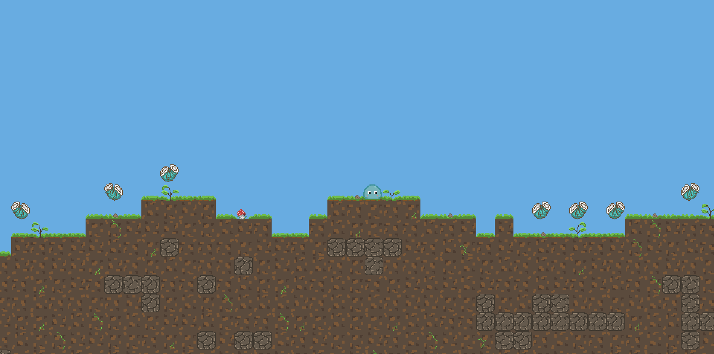

# ProceduralGame


## Description

ProceduralGame is a 2D platformer developed using Python and Pygame.
Our project focuses on **procedural terrain generation**: in each game, the ground is randomly generated with small ascents and descents, making every play-through unique.

The player controls a slime that must collect as much trash as possible.

The slime changes color based on secret key presses (Easter Eggs):
* **Blue**: Normal state
* **Red**: Angry
* **Gray**: Dead

The gameplay is fluid and fast, with a dynamic atmosphere.


## Key Features

* **Procedural terrain generation** (ground varying in height).
* **Main character**: A slime with color changes based on its state.
* **Trash collection** scattered across the terrain.


## Dependencies

* **Python** (latest version)
* **Pygame** (install with the command `pip install pygame`)

## Installation

1.  **Clone this repository**:

    ```[https://github.com/MathysFernandez/ProceduralGame.git](https://github.com/MathysFernandez/ProceduralGame.git)```

2.  **Run the game** with:

    ```main.py```


## How to Play

* **Move** the slime with the directional keys:
    * **Z**: Jump
    * **Q**: Move left
    * **D**: Move right
    * Also with the **Arrow keys**

* **Collect** as much trash as possible to win the game.

* **Avoid** getting stuck.

ℹ️ *(Controls and precise mechanics will evolve as development progresses.)*


## Visuals




## Project Status

🚧 Development in progress 🚧
